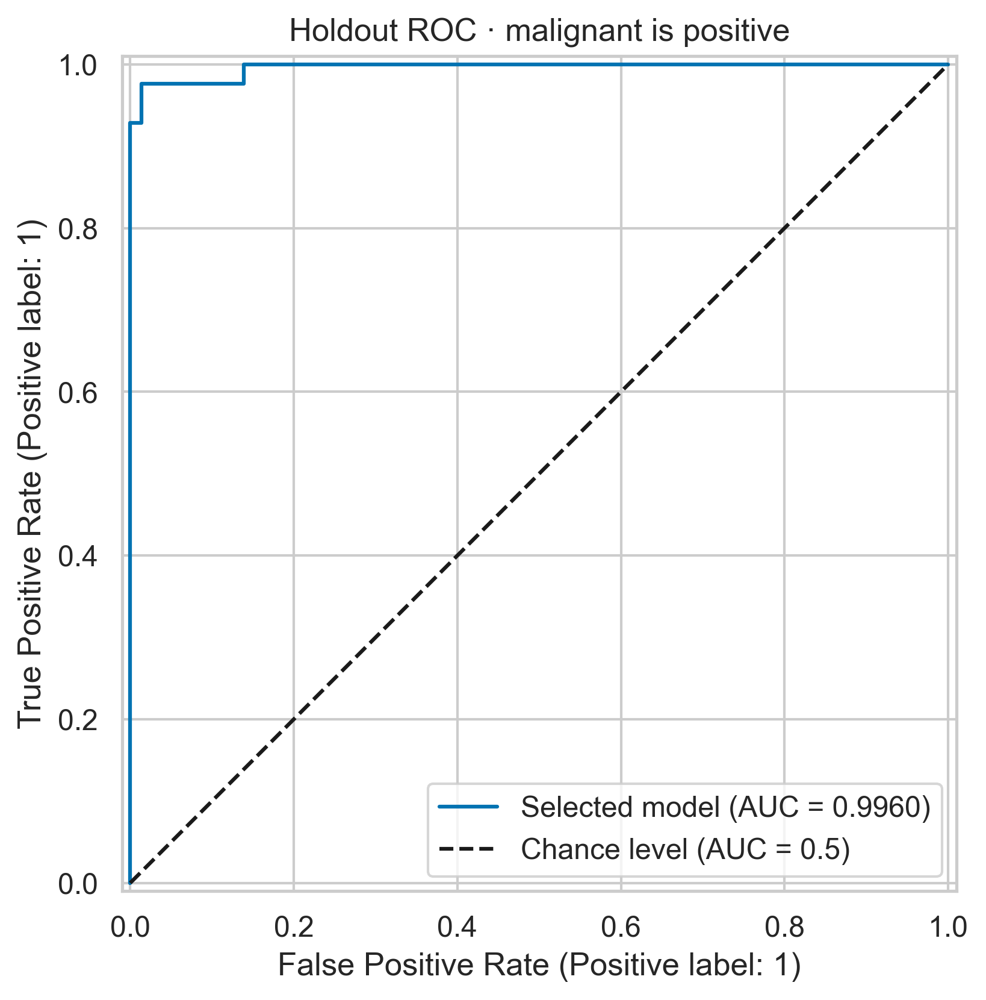
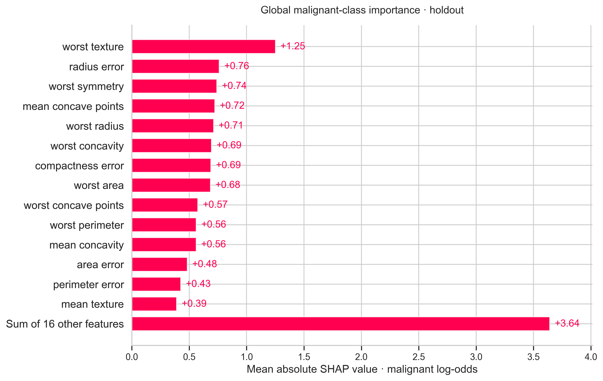

# Breast Cancer Tumor Classification with Explainable AI

An end-to-end, reproducible comparison of logistic regression and random forests, with leakage-safe model selection, an untouched holdout evaluation, and SHAP explanations in an interactive Streamlit dashboard.

> **Educational use only.** This project is not medically validated, is not a diagnostic system, and must not inform patient care. Its results describe a historical benchmark, not screening-population performance.

## Motivation and data

Cell-nucleus size, shape, and texture provide a useful setting for studying interpretable classification. This project explores how supervised models associate those measurements with the dataset's labels; it does not discover biomarkers or establish biological mechanisms.

The [UCI Wisconsin Diagnostic Breast Cancer dataset](https://archive.ics.uci.edu/dataset/17/breast+cancer+wisconsin+diagnostic), distributed through [scikit-learn](https://scikit-learn.org/stable/modules/generated/sklearn.datasets.load_breast_cancer.html), contains **569 samples, 30 numeric features, 212 malignant and 357 benign labels**. Measurements come from digitized images of fine-needle aspirates of breast masses, not raw mammograms. Mean, standard-error, and worst measurements summarize nuclear characteristics. Features retain their original names and source measurement scales; no new physical units are inferred.

`src/data.py` retains `original_target` (0 malignant, 1 benign), centrally converts `target = 1 - original_target` (**malignant = 1, benign = 0**), and adds a readable `label`. All probabilities, positive-class metrics, and explanations refer to malignancy.

## Quick start

Tested with **Python 3.12.14 on Windows**. Python 3.11 or 3.12 is recommended for the pinned dependency set. No external dataset download or account is required at runtime.

```powershell
py -3.12 -m venv .venv
.\.venv\Scripts\python.exe -m pip install -r requirements.txt
.\.venv\Scripts\python.exe scripts/run_all.py
.\.venv\Scripts\python.exe -m streamlit run app.py
```

If the Python launcher does not list 3.12, use the full path to an installed Python 3.12 executable in the first command. For macOS/Linux:

```bash
python3.12 -m venv .venv
source .venv/bin/activate
python -m pip install -r requirements.txt
python scripts/run_all.py
python -m streamlit run app.py
```

With the environment activated, individual commands are:

```bash
python -m src.workflow                     # train, select, evaluate, EDA, SHAP
python -m src.workflow --stage eda         # regenerate training-only EDA
python -m src.workflow --stage explain     # explain existing fitted model; no retraining
python -m pytest -q                        # full tests, including isolated smoke workflow
python -m src.workflow --smoke --output smoke-output
python -m streamlit run app.py
```

`run_all.py` executes the full workflow, regenerates this README from measured artifacts, then runs tests and artifact validation. Any failed stage produces a nonzero exit status. Training may take several minutes. The smaller smoke workflow writes only to its specified directory; tests use a temporary directory. Artifact tests require an initial full run. `requirements.txt` pins direct dependencies; `requirements-lock.txt` records the complete verified environment. To reproduce that exact environment, install the lock file instead. Joblib models are version-sensitive and must only be loaded from trusted sources.

## Architecture

```text
app.py                     Read-only, cached Streamlit dashboard
src/data.py                Dataset loading, target recoding, fixed split
src/train.py               Pipeline-based five-fold grid search and selection
src/evaluate.py            Positive-class metrics and holdout predictions
src/explain.py             Linear/Tree SHAP and numerical consistency checks
src/visualize.py           Training EDA and 300-DPI PNG / SVG export
src/workflow.py            Ordered pipeline stages and artifact persistence
src/utils.py               Paths, labels, probabilities, JSON serialization
scripts/run_all.py         Full execution plus validation and tests
scripts/build_readme.py    README generated from actual result files
tests/                     Data, leakage, prediction, SHAP, artifact and UI tests
models/                    Fitted selected pipeline
results/                   JSON, CSV and NPZ artifacts
figures/                   Twelve figures, each in PNG and SVG
```

## Methodology and leakage prevention

1. Stratified **80/20 split**, `random_state=42`: 455 training and 114 holdout rows. Exact row indices are stored in `results/split.json`.
2. Training-only EDA: descriptive statistics, class comparisons, feature histograms, correlation, missingness, duplicates, constant features, and data types. Whole-dataset class counts are descriptive metadata only; holdout feature values do not guide decisions.
3. Logistic regression: median imputation → standard scaling → L2-regularized logistic regression. The forest uses median imputation → random forest. Preprocessing is inside each pipeline and learned separately within each fold.
4. Both searches use the same five-fold stratified shuffled CV (`random_state=42`). Logistic C: 0.01, 0.1, 1, 10, 100. Forest: 150/300 trees, depth unlimited/5, minimum leaf size 1/3, maximum features sqrt/0.5. There are 21 configurations and 105 CV fits; parallel search uses two workers.
5. **Prespecified selection:** highest mean training CV ROC-AUC, with exact ties favoring logistic regression. `GridSearchCV` refits the winner on all training rows; the selection is persisted before holdout evaluation. The default classification threshold is fixed at 0.5. No reseeding, holdout tuning, or threshold optimization occurs.
6. Only the selected model is evaluated on the holdout. Re-running the command reproduces the same experiment; it is not a new independent test. Global holdout SHAP analysis is post-evaluation interpretation and does not feed back into selection.

CV scores below describe the best configuration of each search. Because the same folds select hyperparameters, these are **not unbiased nested-CV generalization estimates**. Fold standard deviations describe variation, not confidence intervals.

## Verified results

Selected model: **logistic regression**.

| Model | CV ROC-AUC | CV accuracy | CV precision | CV recall | CV F1 |
|---|---:|---:|---:|---:|---:|
| logistic regression | 0.9958 ± 0.0047 | 0.9736 ± 0.0149 | 0.9771 ± 0.0280 | 0.9529 ± 0.0399 | 0.9640 ± 0.0207 |
| random forest | 0.9885 ± 0.0070 | 0.9626 ± 0.0149 | 0.9638 ± 0.0114 | 0.9353 ± 0.0390 | 0.9489 ± 0.0210 |

Best hyperparameters:

```json
{
  "logistic_regression": {
    "classifier__C": 1
  },
  "random_forest": {
    "classifier__max_depth": null,
    "classifier__max_features": "sqrt",
    "classifier__min_samples_leaf": 1,
    "classifier__n_estimators": 150
  }
}
```

Holdout: **114 samples (42 malignant, 72 benign)**; precision, recall, and F1 treat malignancy as positive.

| Metric | Measured value |
|---|---:|
| Accuracy | 0.964912 |
| Precision | 0.975000 |
| Recall | 0.928571 |
| F1 | 0.951220 |
| Specificity | 0.986111 |
| Roc Auc | 0.996032 |
| Average Precision | 0.994274 |

Confusion matrix, rows actual / columns predicted, both ordered **benign, malignant**:

```text
[71, 1]
[3, 39]
```




## Reading the visualizations

| Figure | Interpretation |
|---|---|
| `class_distribution` | Training class counts; class imbalance provides context for accuracy. |
| `feature_distributions` | Class-wise training densities of four prespecified measurements; overlap illustrates ambiguity. |
| `correlation_heatmap` | Annotated training Pearson correlations for all 30 features; substantial redundancy limits simple importance interpretations. |
| `confusion_matrix` | Actual versus predicted labels at the fixed threshold; axes explicitly name both classes. |
| `roc_curve` | Sensitivity versus false-positive rate over thresholds; diagonal represents chance ranking. |
| `precision_recall_curve` | Precision versus recall; horizontal baseline is the holdout malignant prevalence. Average precision summarizes the curve. |
| `shap_global_bar` | Mean absolute malignant-class SHAP contribution across holdout rows. |
| `shap_beeswarm` | Each dot is one sample; horizontal position is contribution and color encodes feature value. |
| `shap_dependence_1/2` | Original measurement versus contribution for the two leading global features. |
| `shap_local_malignant/benign` | First actual malignant/benign holdout rows in fixed split order, without selecting favorable predictions. Titles include actual label, predicted label, and malignancy probability. |

Every figure has a 300-DPI PNG and an editable SVG in `figures/`. The dashboard provides all five sections: Overview, Model performance, Feature analysis, Explainable AI, and About. Its local view covers every held-out sample and includes exact feature contributions. No clinical-input form is provided.

## Mathematical intuition

**Logistic regression.** For standardized features z, the model learns a score `s = b + sum(w_j * z_j)` and transforms it to `P(malignant) = 1 / (1 + exp(-s))`. Regularization shrinks coefficients; smaller C means stronger shrinkage. The score is log-odds, not a probability.

**Random forest.** Many decision trees learn branching rules from bootstrap samples and random feature subsets. Averaging their malignant leaf probabilities reduces the variance of a single tree and allows nonlinear relationships.

**ROC-AUC.** AUC measures how often a randomly chosen malignant sample receives a higher score than a randomly chosen benign sample, with ties counted halfway. An AUC of 0.5 corresponds to chance ranking. It does not establish calibration or performance at a chosen clinical threshold.

**SHAP.** Shapley values allocate the difference from a background expectation among features: `model_output = base_value + sum(feature_contributions)`. Contributions average marginal effects across feature coalitions under the explainer's background assumptions. Positive contributions raise the malignant score; negative contributions lower it. Global importance averages their magnitudes; a local waterfall explains a single sample.

The selected model is explained on the **log-odds scale** using a training-only background. Logistic explanations use LinearExplainer on the pipeline's transformed features and apply the sigmoid only after summing log-odds contributions. Tree explanations use interventional TreeExplainer in probability space and explicitly select class 1. The numerical maximum additivity error across all holdout rows is **3.553e-15**. Original measurement values appear in plots even when contributions were calculated for standardized inputs. SHAP uses a deterministic training-background subsample (up to 100 rows). See the [LinearExplainer documentation](https://shap.readthedocs.io/en/stable/generated/shap.LinearExplainer.html) and [TreeExplainer documentation](https://shap.readthedocs.io/en/stable/generated/shap.TreeExplainer.html).

SHAP reflects model associations, **not biological causation**. Correlated features can redistribute attribution; the default interventional background does not preserve all feature dependencies.

## Error interpretation and limitations

A false negative is an actual malignant sample predicted benign; a false positive is an actual benign sample predicted malignant. In a real diagnostic pathway these error types could have different consequences, but this benchmark does not evaluate patient outcomes, clinical workflows, or deployment safety. Its probabilities are model scores, not validated individual risk estimates.

The historical sample is small and not a representative screening cohort. There is no external or prospective validation, calibration assessment, subgroup fairness analysis, causal analysis, or assessment of distribution shift. One fixed holdout has substantial sampling uncertainty. High benchmark scores do not establish medical usefulness. Feature importance cannot identify independently validated biomarkers.

## Artifacts and verification

- `metrics.json`: actual holdout metrics, classification report, CV summaries, selected model, seeds and label mapping.
- `selection.json`: training-only decision recorded before evaluation.
- `cv_search.csv` / `cv_summary.csv`: all search candidates and fold-level metrics for the best configurations.
- `holdout_metrics.csv` / `holdout_predictions.csv`: scalar scores and each sample's label, prediction and malignancy probability.
- `dataset_summary.json`, `descriptive_statistics.csv`, `class_comparisons.csv`: training EDA and dataset metadata.
- `shap_values.npz` / `shap_metadata.json`: contributions, baseline, original measurements, feature names, row IDs, output scale and reconstruction error.
- `environment.json`, `requirements-lock.txt`: verified runtime versions.

Tests cover dimensions and mappings; reproducible, disjoint stratified splits; fold-specific preprocessing; model-selection rule; prediction shape, range and class labels; model serialization; linear and tree explanation paths; legacy and modern SHAP shapes; all PNG/SVG/JSON/CSV/NPZ artifacts; a smaller isolated end-to-end run; and Streamlit navigation and sample selection. Streamlit's AppTest runs all sections without needing a browser. The full command runs this suite after creating artifacts.

## Resume bullet options

- **Technical:** Built a reproducible scikit-learn classification pipeline comparing logistic regression and random forests with five-fold training-only model selection, achieving **96.49% holdout accuracy and 0.9960 ROC-AUC**; implemented numerically verified SHAP explanations, automated tests, and a Streamlit dashboard.
- **Biology-focused:** Analyzed cell-nucleus measurements from 569 fine-needle aspirate samples in the Wisconsin diagnostic benchmark, using interpretable machine learning to classify dataset labels with **96.49% holdout accuracy and 0.9960 ROC-AUC**, while distinguishing statistical associations from biological causation and clinical validation.
